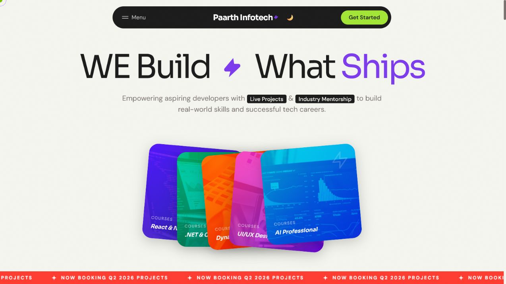
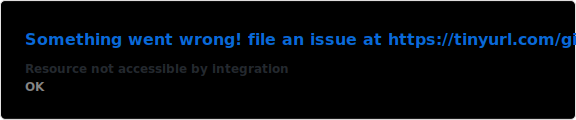
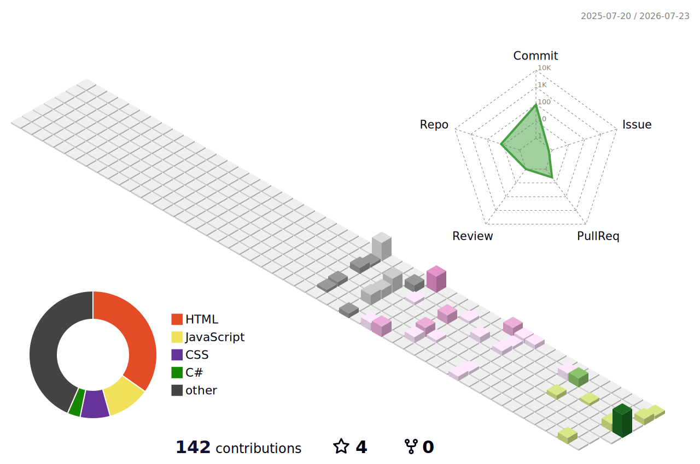

<!-- ========================= ANIMATED HERO ========================= -->

<p align="center">
  
</p>

<div align="center">

  <a href="https://git.io/typing-svg">
    
  </a>

  <br />

  <a href="https://heyyyrathi-portfolio.runasp.net/">
    
  </a>
  <a href="https://www.linkedin.com/in/ayush-rathi-575076281/">
    
  </a>
  <a href="mailto:rathiaccess@gmail.com">
    
  </a>
  <a href="https://github.com/Hey-Rathiii?tab=followers">
    
  </a>

  <br /><br />

  

</div>

---

## ⚡ About me

I’m **Ayush Rathi**, a developer from **Meerut, India**, focused on building complete web products with **C#**, **ASP.NET Core**, **JavaScript**, and **SQL Server**.

I enjoy working where backend logic, database architecture, application security, and thoughtful UI design come together.

```yaml
name: Ayush Rathi
role: .NET Full-Stack Developer
location: Meerut, Uttar Pradesh, India

currently_building:
  - Paarth Exam System
  - ASP.NET Core applications
  - SQL-backed web platforms

currently_learning:
  - Advanced C#
  - ASP.NET Core architecture
  - Data Structures and Algorithms
  - Deployment and cloud hosting
  - Application security

open_to:
  - .NET collaborations
  - REST API projects
  - Full-stack applications
  - UI and responsive design work
```

---

# 🚀 Featured projects

<table>
  <tr>
    <td width="50%" valign="top">
      <p align="center">
        <a href="https://github.com/Hey-Rathiii/Online-Exam-System">
          
        </a>
      </p>
      <h3 align="center">Online Exam System</h3>
      <p align="center">
        Secure authentication, registration, session-protected pages,
        SQL integration, and online exam management.
      </p>
      <p align="center">
        
        
        
      </p>
      <p align="center">
        <a href="https://github.com/Hey-Rathiii/Online-Exam-System">
          <strong>View repository →</strong>
        </a>
      </p>
    </td>
    <td width="50%" valign="top">
      <p align="center">
        <a href="https://heyyyrathi-portfolio.runasp.net/">
          
        </a>
      </p>
      <h3 align="center">Developer Portfolio</h3>
      <p align="center">
        A responsive personal portfolio designed to present projects,
        skills, education, and developer experience.
      </p>
      <p align="center">
        
        
        
      </p>
      <p align="center">
        <a href="https://heyyyrathi-portfolio.runasp.net/">
          <strong>Visit live portfolio →</strong>
        </a>
      </p>
    </td>
  </tr>

  <tr>
    <td width="50%" valign="top">
      <p align="center">
        <a href="https://paarth-infotech-website.vercel.app/">
          
        </a>
      </p>
      <h3 align="center">Paarth Infotech</h3>
      <p align="center">
        A polished learning and digital-services experience featuring
        live projects, industry mentorship, and responsive design.
      </p>
      <p align="center">
        
        
        
      </p>
      <p align="center">
        <a href="https://paarth-infotech-website.vercel.app/">
          <strong>Visit live website →</strong>
        </a>
        &nbsp;·&nbsp;
        <a href="https://github.com/Hey-Rathiii/Paarth-Infotech">
          <strong>Repository</strong>
        </a>
      </p>
    </td>
    <td width="50%" valign="top">
      <p align="center">
        <a href="https://github.com/Hey-Rathiii/UserManagementAPI">
          
        </a>
      </p>
      <h3 align="center">User Management API</h3>
      <p align="center">
        A focused REST API project demonstrating user-management
        workflows, endpoint design, and backend fundamentals.
      </p>
      <p align="center">
        
        
        
      </p>
      <p align="center">
        <a href="https://github.com/Hey-Rathiii/UserManagementAPI">
          <strong>View repository →</strong>
        </a>
      </p>
    </td>
  </tr>
</table>

<p align="center">
  <a href="https://github.com/Hey-Rathiii/StudentManagerPro">
    
  </a>
  <a href="https://github.com/Hey-Rathiii/Daily-JavaScript-Practise-Tasks">
    
  </a>
</p>

---

# 🧰 Technology toolbox

<div align="center">

  

  <br /><br />

  
  
  
  

</div>

---

# 📊 GitHub command center

<p align="center">
  <picture>
    <source
      media="(prefers-color-scheme: dark)"
      srcset="./profile/stats-dark.svg"
    />
    <source
      media="(prefers-color-scheme: light), (prefers-color-scheme: no-preference)"
      srcset="./profile/stats-light.svg"
    />
    
  </picture>

  <picture>
    <source
      media="(prefers-color-scheme: dark)"
      srcset="./profile/top-langs-dark.svg"
    />
    <source
      media="(prefers-color-scheme: light), (prefers-color-scheme: no-preference)"
      srcset="./profile/top-langs-light.svg"
    />
    
  </picture>
</p>

<p align="center">
  <sub>
    These cards are generated inside this repository instead of relying on
    rate-limited public statistics endpoints.
  </sub>
</p>

---

# 🌌 Animated contribution universe

<p align="center">
  
</p>

---

# 📈 Live commit activity

<p align="center">
  <a href="https://github.com/Hey-Rathiii">
    
  </a>
</p>

---

# 🐍 Watch my contributions get eaten

<p align="center">
  <picture>
    <source
      media="(prefers-color-scheme: dark)"
      srcset="./profile/github-snake-dark.svg"
    />
    <source
      media="(prefers-color-scheme: light), (prefers-color-scheme: no-preference)"
      srcset="./profile/github-snake.svg"
    />
    
  </picture>
</p>

---

<div align="center">

  <h2>🤝 Let’s build something useful</h2>

  <p>
    I’m open to collaborating on .NET applications, REST APIs,
    SQL-backed platforms, responsive interfaces, and deployment-focused projects.
  </p>

  <a href="https://heyyyrathi-portfolio.runasp.net/">
    
  </a>
  <a href="mailto:rathiaccess@gmail.com">
    
  </a>

  <br /><br />

  <em>Ship useful software. Learn in public. Improve every iteration.</em>

</div>

<p align="center">
  
</p>
