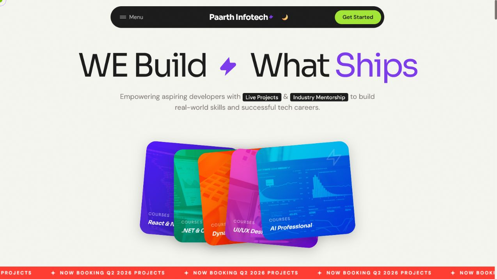
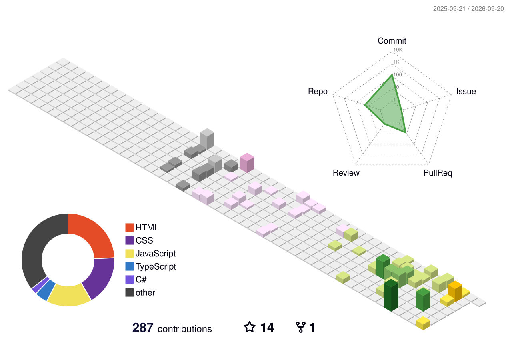

<!--
  GitHub profile README for Hey-Rathiii.
  Automated cards and contribution visuals are refreshed by workflows in
  .github/workflows. Keep generated SVG files out of manual edits.
-->

  
  &nbsp;&nbsp;
  
  &nbsp;&nbsp;
  

  

##  About Me

- 💳 My full name is **Ayush Rathi**
- 🎓 I completed my **B.Tech in Computer Science** at **IIMT University, Meerut** in 2026
- 💼 I have hands-on product development experience with **Paarth Infotech**
- 💻 My focus is **.NET full-stack web development**
- 🌏 I’m based in **Meerut, Uttar Pradesh, India**
- 🔭 I’m building assessment platforms and production-ready ASP.NET Core applications
- 🧠 I’m interested in backend architecture, application security, and thoughtful UI design
- 😎 My quote is ***“Ship useful software. Learn in public. Improve every iteration.”***
- ☕ Fun fact: I’d rather debug a race condition than skip my morning coffee

 

---

## 🚀 Selected work

<table>
  <tr>
    <td width="50%" valign="top">
      

        
      

      <h3 align="center">Online Exam System</h3>
      

        Authentication, registration, session-protected pages, SQL integration,
        and online assessment management in one complete workflow.
      

      

        
        
        
      

      

        <a href="https://github.com/Hey-Rathiii/Online-Exam-System"><strong>Explore repository →</strong></a>
      

    </td>
    <td width="50%" valign="top">
      

        
      

      <h3 align="center">Developer Portfolio</h3>
      

        A responsive portfolio for presenting projects, skills, education,
        and professional experience with a clear visual hierarchy.
      

      

        
        
        
      

      

        <a href="https://heyyyrathi-portfolio.runasp.net/"><strong>Visit live portfolio →</strong></a>
      

    </td>
  </tr>
  <tr>
    <td width="50%" valign="top">
      

        
      

      <h3 align="center">Paarth Infotech</h3>
      

        A polished learning and digital-services experience featuring
        live projects, industry mentorship, and responsive design.
      

      

        
        
        
      

      

        <a href="https://paarth-infotech-website.vercel.app/"><strong>Live website →</strong></a>
        &nbsp;·&nbsp;
        <a href="https://github.com/Hey-Rathiii/Paarth-Infotech"><strong>Repository</strong></a>
      

    </td>
    <td width="50%" valign="top">
      

        
      

      <h3 align="center">User Management API</h3>
      

        A focused REST API project demonstrating user-management workflows,
        endpoint design, and clean backend fundamentals.
      

      

        
        
        
      

      

        <a href="https://github.com/Hey-Rathiii/UserManagementAPI"><strong>Explore repository →</strong></a>
      

    </td>
  </tr>
</table>

  
  

---

##  Some Languages and Tools

  

    

  
  
  
  

---

##  About Some Stats

  
  

  

  
<strong>More GitHub activity details</strong>

   

  

    
  

  

    
    
  

  

    
    
  

  

    Summary cards refresh automatically every day and after profile updates.
  

---

## 🌌 Animated contribution universe

  

---

## 📈 Recent commit activity

  

---

## 🐍 Contribution trail

  <picture>
    <source media="(prefers-color-scheme: dark)" srcset="./profile/github-snake-dark.svg" />
    <source media="(prefers-color-scheme: light), (prefers-color-scheme: no-preference)" srcset="./profile/github-snake.svg" />
    
  </picture>

---

##  For More Information, Please Check Out or Connect Me Via

  
  &nbsp;&nbsp;
  
  &nbsp;&nbsp;
  
  &nbsp;&nbsp;
  

  

    I’m open to collaborating on .NET applications, REST APIs,
    SQL-backed platforms, responsive interfaces, and deployment-focused projects.
  

  
  

    

  😍 Thanks for visiting my profile! Have a nice day! 😊
   
  © 2026 Ayush Rathi · Hey-Rathiii

  

